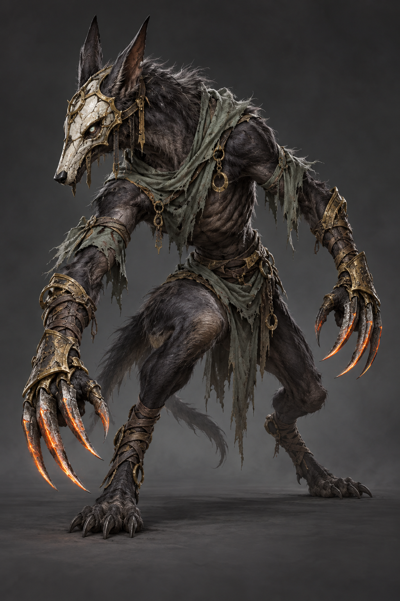
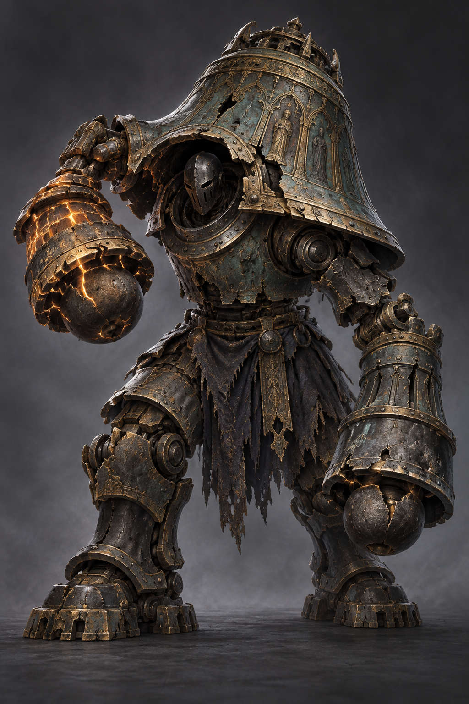
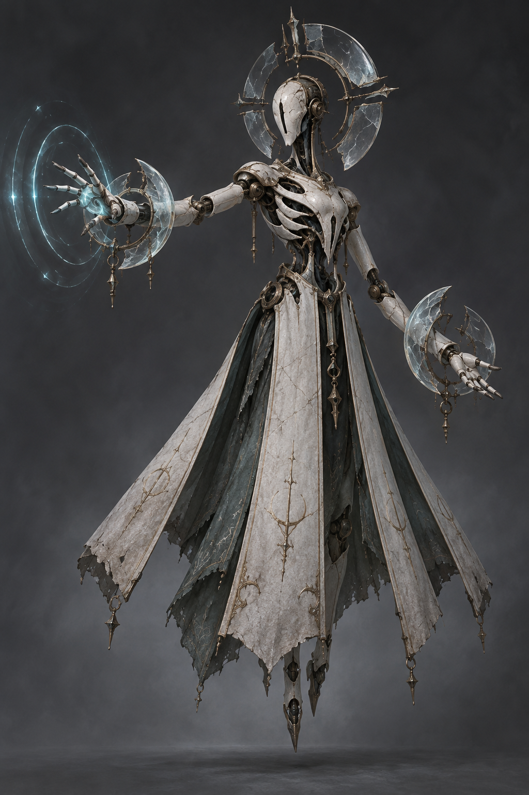

# AFTERIMAGE 몬스터 시안 3종 v1

제작일: 2026-10-05 (Asia/Seoul)
생성 방식: 내장 `image_gen` 도구로 각각 독립 생성. 불투명 배경의 전신 디자인 검토용 PNG.
현재는 컨셉 이미지이며 게임에 적용된 3D 모델·리깅·애니메이션이 아니다. 아래 공격은 디자인에 맞춘 제안이다.

## 1. 재의 사냥개

파일: `ash-hound-v1.png`

낮게 웅크린 야수 실루엣, 긴 앞발과 금속 발톱. 제안 패턴: 낮은 돌진 → 좌우 연타, 후퇴 후 재돌진. 일반/정예 적 후보.



### 최종 생성 프롬프트

```text
Use case: stylized-concept.
Asset type: polished original monster design exploration for AFTERIMAGE, a dark fantasy mobile timing-parry combat game, suitable as reference for a future articulated 3D character.
Style/medium: premium semi-realistic game concept painting with convincing sculptural volume, beautifully observed materials and restrained painterly texture; sophisticated and unsettling, not cartoon, not a generic screenshot.
Scene/backdrop: quiet charcoal gray studio mist with a very subtle ground shadow, no scenery or architecture. Opaque background.
Composition: portrait 2:3 composition, exactly one complete character, entire silhouette and weapon tips inside the canvas with generous breathing room, three-quarter view facing toward the viewer's LEFT (the player is on that side in game). Show both arms separately, with clear negative space between limbs and torso, readable at phone size.
Lighting: broad soft key light, restrained cool rim, dark materials remain readable; no excessive bloom. Weathered antique metal, charcoal, muted ivory, restrained luminous accents consistent with a ruined dark fantasy world.
Constraints: original design, no recognizable existing franchise character, no extra characters, no insets, no graphic design labels, no text, no UI, no logo or watermark, no gore. No extra limbs. Strong distinctive silhouette and credible joints for animation.

Subject: THE ASH HOUND, a lean monstrous bipedal hunting beast in a low, predatory combat-ready crouch. Far from a human armored knight: long powerful forearms, narrow hunched torso, short ragged charcoal fur, sinewy digitigrade hind legs, a long angular canine muzzle covered by a fractured matte ivory ceremonial faceplate, tiny pale cold eyes. Its two forepaws are encased in worn brass bracers with three broad curved steel claw blades on each; the paws are lowered on opposite sides and clearly separated, one slightly reaching forward toward the left. Restrained ember-orange heat appears only along the active foremost claw edges to suggest attack telegraphing. Ragged sage cloth strips at the upper arms, minimal equipment, no weapons held in hands. Clear elbows, wrists and ankle joints. The look should communicate fast lateral swipes, sudden low lunges and unpredictable claw combos. Entire creature, ears and claw tips visible, grounded poised tension, not leaping or blurred.
```

## 2. 종을 짊어진 집행자

파일: `bell-executioner-v1.png`

종을 두른 넓고 무거운 실루엣, 양팔의 거대한 철제 주먹. 제안 패턴: 지연 강타, 양손 내려찍기, 지면 파동. 정예/보스 후보.



### 최종 생성 프롬프트

```text
Use case: stylized-concept.
Asset type: polished original monster design exploration for AFTERIMAGE, a dark fantasy mobile timing-parry combat game, suitable as reference for a future articulated 3D character.
Style/medium: premium semi-realistic game concept painting with convincing sculptural volume, beautifully observed materials and restrained painterly texture; sophisticated and unsettling, not cartoon, not a generic screenshot.
Scene/backdrop: quiet charcoal gray studio mist with a very subtle ground shadow, no scenery or architecture. Opaque background.
Composition: portrait 2:3 composition, exactly one complete character, entire silhouette and weapon tips inside the canvas with generous breathing room, three-quarter view facing toward the viewer's LEFT (the player is on that side in game). Show both arms separately, with clear negative space between limbs and torso, readable at phone size.
Lighting: broad soft key light, restrained cool rim, dark materials remain readable; no excessive bloom. Weathered antique metal, charcoal, muted ivory, restrained luminous accents consistent with a ruined dark fantasy world.
Constraints: original design, no recognizable existing franchise character, no extra characters, no insets, no graphic design labels, no text, no UI, no logo or watermark, no gore. No extra limbs. Strong distinctive silhouette and credible joints for animation.

Subject: THE BELL EXECUTIONER, a massive squat humanoid construct with an instantly recognizable inverted-bell silhouette. An enormous cracked ancient bronze bell forms its shoulder/back mantle around a small deeply recessed faceless iron head; the flared bell edge ends at the upper torso so both arms and all joints remain free. Verdigris bronze shell, blackened forged iron, worn pale gold edges, broad slab feet and articulated thick legs. Exactly two huge long arms with different battered but balanced forged gauntlets, each shaped like a blunt bell clapper, hanging apart at its sides; the fists are plainly visible against the background. A narrow warm amber glow from fractures in one raised gauntlet suggests a charged delayed strike. Small frayed charcoal waist cloth, a few substantial bolts and rivets, sparse architectural ornament. No handheld sword, no separate bell prop, no giant chains obscuring the silhouette. Pose: leaning slightly forward toward the left, one fist held partway up in a deliberate heavy wind-up, other fist low. Communicate immense weight, delayed crushing attacks, simultaneous two-fist ground slams and ground shockwaves. Both feet and every outer edge fully visible.
```

## 3. 유리 성가의 사제

파일: `glass-cantor-v1.png`

가느다란 부유 실루엣, 도자기 몸체와 유리 후광·손목 장치. 제안 패턴: 좌우 에너지 연사, 후퇴 후 파동, 양손 동시 발사. 원거리 정예 후보.



### 최종 생성 프롬프트

```text
Use case: stylized-concept.
Asset type: polished original monster design exploration for AFTERIMAGE, a dark fantasy mobile timing-parry combat game, suitable as reference for a future articulated 3D character.
Style/medium: premium semi-realistic game concept painting with convincing sculptural volume, beautifully observed materials and restrained painterly texture; sophisticated and unsettling, not cartoon, not a generic screenshot.
Scene/backdrop: quiet charcoal gray studio mist with a very subtle ground shadow, no scenery or architecture. Opaque background.
Composition: portrait 2:3 composition, exactly one complete character, entire silhouette and weapon tips inside the canvas with generous breathing room, three-quarter view facing toward the viewer's LEFT (the player is on that side in game). Show both arms separately, with clear negative space between limbs and torso, readable at phone size.
Lighting: broad soft key light, restrained cool rim, dark materials remain readable; no excessive bloom. Weathered antique metal, charcoal, muted ivory, restrained luminous accents consistent with a ruined dark fantasy world.
Constraints: original design, no recognizable existing franchise character, no extra characters, no insets, no graphic design labels, no text, no UI, no logo or watermark, no gore. No extra limbs. Strong distinctive silhouette and credible joints for animation.

Subject: THE GLASS CANTOR, a tall slender levitating nonhuman ritual automaton, visually delicate and eerie rather than heavily armored. A smooth elongated cracked porcelain face with a narrow vertical dark slit, a broken circular halo made of a few large smoky glass segments held in antique brass behind the head. Ivory ceramic torso ribs with black open gaps and antique brass ball joints, two long articulated arms extending distinctly away from the body. Each open palm is framed by its own broad crescent-shaped translucent smoky crystal resonator cuff; a small controlled cyan energy ripple gathers around one palm, the other has unlit transparent crystal. Two legs are partly visible below a long split ash-white vestment whose four broad hanging panels separate cleanly, with dark sage inner cloth; hover a little above a soft ground shadow. No extra arms, no staff, no orb floating away from the hands, no large wings, no dense particle cloud. Pose: slight three-quarter left-facing hover, one hand reaching toward the left to emit a wave, the other poised near the side, both hands clearly visible. Communicate long-range energy waves, alternating palm volleys, and a simultaneous two-hand pulse. Entire halo and hem inside the frame. Refined icy glass highlights and worn ivory fabric, almost no warm emission.
```
