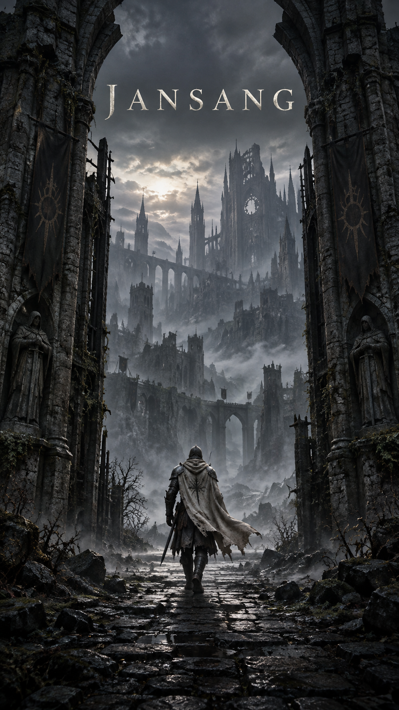
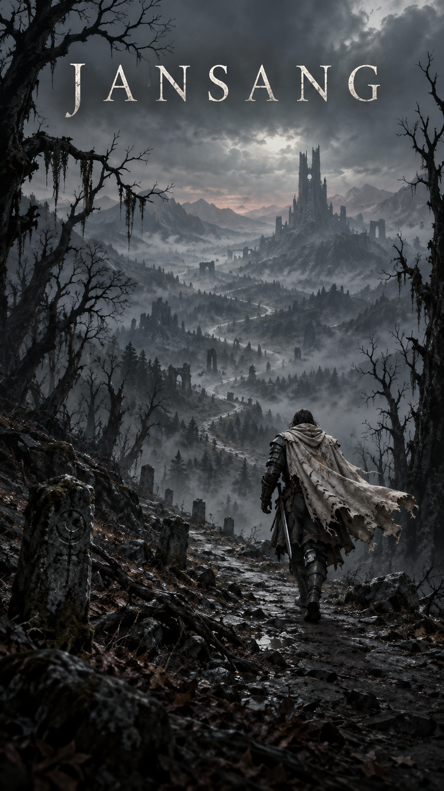
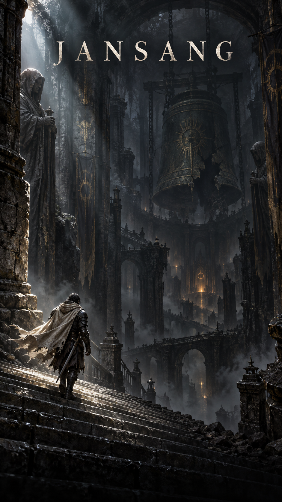

# JANSANG 첫 화면 시안 3종 v1

제작일: 2026-10-06 (Asia/Seoul)
생성 도구: 내장 image_gen. 각 시안은 별도 요청으로 생성한 불투명 세로 9:16 PNG다.
용도: 첫 화면 디자인 검토. JANSANG 타이틀을 이미지에 포함했으며 게임 화면에는 아직 적용하지 않았다.

2026-10-06 선택/적용: 사용자 선택에 따라 2번 `title-pilgrimage-v1.png`를 게임 첫 화면에 적용했다. 1·3번은 검토용 원본으로 보존한다.

## 01 · 폐허의 성문

파일: `title-gate-v1.png`



### 최종 생성 프롬프트

```text
Use case: stylized-concept.
Asset type: first-screen title key art for the original dark fantasy mobile game JANSANG.
Primary request: a gloomy cinematic still of a lone warrior setting off on an ominous adventure, with the game title included.
Format: full-bleed vertical 9:16 portrait composition suitable for a phone title screen, no phone device or mockup frame. One complete scene, not a collage.
Subject: exactly one small solitary traveling warrior seen from behind, worn dark steel armor, a weathered ash-ivory short cloak moving gently in the wind, one sheathed longsword at the hip. The posture and planted forward step clearly suggest departure into the unknown; believable anatomy. No visible face.
Style/medium: polished painterly cinematic dark fantasy key art with realistic atmospheric depth and tactile weathered materials, restrained fine grain, elegant authored composition. Haunting, solemn and foreboding, not triumphant. The warrior is readable at mobile size and the setting feels immense.
Text (verbatim): "JANSANG" — spelled J A N S A N G, exactly once. Large refined uppercase ancient Roman serif lettering, spacious tracking, aged pale ivory, crisp legibility. Centered horizontally in the upper fifth, with generous margin from all edges and quiet atmospheric negative space behind it. The title is a clean graphic overlay, not a physical sign in the environment.
Constraints: original artwork, no recognizable franchise characters, no additional words or slogans, no menu buttons, no HUD, no copyright marks, no watermarks, no gore. Keep the lower 12% relatively quiet and dark for later UI, while still part of the painted scene. Deep shadows must retain meaningful texture; avoid pure black unreadability, neon effects, overdecorated typography, bright heroic sunlight. Opaque background.

Scene/backdrop: The threshold of a colossal ruined fortress at predawn, framed by a broken pointed stone gate. Beyond the opening, a forbidding abandoned cathedral city vanishes into cold mist. Tall ravaged ramparts and blind windows imply danger without showing enemies. Wet uneven cobblestones lead from the foreground straight into the gate; sparse thorn brambles cling to stone.
Composition/framing: a grounded low, over-the-shoulder long shot. Warrior occupies the lower middle about 15% of image height, walking away through the gateway; the gate's massive verticals create a strong enclosing silhouette. Distant city remains visible and mysterious. The title sits against a calm foggy upper sky band, not on busy stone.
Lighting/mood: dim silver daylight coming through the gateway reveals the warrior's cloak and the wet path; foreground is in deep shadow. Palette: charcoal, muted moss green, cold stone gray, restrained antique brass. Sense of a fateful first step.
```

## 02 · 안개 속 순례길

파일: `title-pilgrimage-v1.png`



### 최종 생성 프롬프트

```text
Use case: stylized-concept.
Asset type: first-screen title key art for the original dark fantasy mobile game JANSANG.
Primary request: a gloomy cinematic still of a lone warrior setting off on an ominous adventure, with the game title included.
Format: full-bleed vertical 9:16 portrait composition suitable for a phone title screen, no phone device or mockup frame. One complete scene, not a collage.
Subject: exactly one small solitary traveling warrior seen from behind, worn dark steel armor, a weathered ash-ivory short cloak moving gently in the wind, one sheathed longsword at the hip. The posture and planted forward step clearly suggest departure into the unknown; believable anatomy. No visible face.
Style/medium: polished painterly cinematic dark fantasy key art with realistic atmospheric depth and tactile weathered materials, restrained fine grain, elegant authored composition. Haunting, solemn and foreboding, not triumphant. The warrior is readable at mobile size and the setting feels immense.
Text (verbatim): "JANSANG" — spelled J A N S A N G, exactly once. Large refined uppercase ancient Roman serif lettering, spacious tracking, aged pale ivory, crisp legibility. Centered horizontally in the upper fifth, with generous margin from all edges and quiet atmospheric negative space behind it. The title is a clean graphic overlay, not a physical sign in the environment.
Constraints: original artwork, no recognizable franchise characters, no additional words or slogans, no menu buttons, no HUD, no copyright marks, no watermarks, no gore. Keep the lower 12% relatively quiet and dark for later UI, while still part of the painted scene. Deep shadows must retain meaningful texture; avoid pure black unreadability, neon effects, overdecorated typography, bright heroic sunlight. Opaque background.

Scene/backdrop: A deserted narrow pilgrim path threading through an ancient dead forest on a windswept ridge. Black leafless trees lean inward with sparse hanging moss. The path winds in an S-shape into a vast fog-filled valley where a single distant fractured tower barely emerges. Small broken roadside stone markers, wet roots, sparse ash falling through the air.
Composition/framing: wide-lens long shot in vertical format, asymmetrical scenic depth. Warrior low in the right third, mid-step heading diagonally toward the winding path and the far-off tower. Dominant curved trail creates a strong visual departure into the distance. Upper fifth remains a clean pale-dim mist zone for the title. The loneliness of the landscape matters more than the architecture.
Lighting/mood: oppressive overcast dusk, diffuse cold blue-green fog, near-black tree silhouettes, a very faint desaturated rust haze along the remote horizon. Soft silver rim light on the ivory cloak, wet leaves and stone. Quiet dread, isolation, and a long journey ahead.
```

## 03 · 심연으로 내려가는 계단

파일: `title-descent-v1.png`



### 최종 생성 프롬프트

```text
Use case: stylized-concept.
Asset type: first-screen title key art for the original dark fantasy mobile game JANSANG.
Primary request: a gloomy cinematic still of a lone warrior setting off on an ominous adventure, with the game title included.
Format: full-bleed vertical 9:16 portrait composition suitable for a phone title screen, no phone device or mockup frame. One complete scene, not a collage.
Subject: exactly one small solitary traveling warrior seen from behind, worn dark steel armor, a weathered ash-ivory short cloak moving gently in the wind, one sheathed longsword at the hip. The posture and planted forward step clearly suggest departure into the unknown; believable anatomy. No visible face.
Style/medium: polished painterly cinematic dark fantasy key art with realistic atmospheric depth and tactile weathered materials, restrained fine grain, elegant authored composition. Haunting, solemn and foreboding, not triumphant. The warrior is readable at mobile size and the setting feels immense.
Text (verbatim): "JANSANG" — spelled J A N S A N G, exactly once. Large refined uppercase ancient Roman serif lettering, spacious tracking, aged pale ivory, crisp legibility. Centered horizontally in the upper fifth, with generous margin from all edges and quiet atmospheric negative space behind it. The title is a clean graphic overlay, not a physical sign in the environment.
Constraints: original artwork, no recognizable franchise characters, no additional words or slogans, no menu buttons, no HUD, no copyright marks, no watermarks, no gore. Keep the lower 12% relatively quiet and dark for later UI, while still part of the painted scene. Deep shadows must retain meaningful texture; avoid pure black unreadability, neon effects, overdecorated typography, bright heroic sunlight. Opaque background.

Scene/backdrop: An enormous subterranean ruined sanctuary, entered by a vertiginous stone staircase descending into a misty chasm. Monumental eroded columns and a cracked ancient suspended bronze bell recede into darkness. Narrow bridges and lower landings disappear into depth; there are no other people. The destination is hinted by a tiny dim amber glow far below, not a literal fire.
Composition/framing: a high three-quarter rear view of the traveler, low-left in the image, taking the first step down the wide staircase. The staircase forms a powerful diagonal leading toward the central abyss; huge vertical vaults rise overhead. Warrior occupies about 13% of image height. Upper fifth is a calm shadowy mist plane with subtle stone texture behind the title. Strong scale contrast and layers of depth, no aerial map look.
Lighting/mood: a slender shaft of cold daylight from an unseen opening catches the warrior's cloak and a few stair edges; distant muted amber reflections suggest the unknown. Palette: graphite black, smoked bronze, pale ash, extremely restrained tarnished gold. Sacred ruin, suffocating silence, apprehension, beginning a dangerous descent.
```
